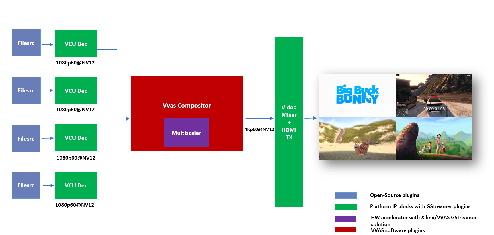

# Compositor Application

This tutorial covers steps to create compositor based example pipelines.
This tutorial explains to build four channel compositor pipeline that processes 4 streams in parallel.
This tutorial explains step by step approach to build zcu104 based platform and application for running compositor pipeline.

# Folder structure

Below is the folder structure for building and running optical flow based analytics tutorial

```bash
 compositor_example
    ├── hw
    │   ├── kernel_xml
    │   │   ├── dpu
    │   │   └── sfm
    │   ├── prj_conf
    │   └── scripts
    └── sw
        └── vvas-gst-plugins
            └── sys
                └── compositor
```

hw folder contains files related to building the platform on zcu104.

sw/vvas-gst-plugins contains source code for vvas_xcompositor plugin


# Prerequisites

Before attempting the execution of application, please ensure that all the pre-requisites mentioned below are fulfilled.

## Hardware Requirements

- ZCU104 Evaluation Board Rev 1.0

- Micro USB cable, connected to laptop or desktop computer for the terminal emulator

- MicroSD card, 8 GB or larger, class 10 (recommended)

- HDMI 2.0 supported Monitor with 3840x2160 as the native resolution

- HDMI 2.0 cable

## Software/Tools Requirements

(Refer Vitis Unified Software Development Platform 2021.2 Documentation for installation instructions)

- Vitis™ Unified Software Platform version 2021.2

- Petalinux tool version 2021.2

- Serial terminal emulator (for example, Tera Term)

- Git

- Host system with Ubuntu 18.04/20.04 (Recommended)

- Balena Etcher flashing tool

## System Requirements
- Board must have access to the internet and be accessible from your development system
# Pre-built binaries

You may download the pre-built binaries by clicking the link [Release package](https://www.xilinx.com/member/forms/download/xef.html?filename=vvas_xcompositor_2021.2_zcu104.zip)  


**Note:**

**The pre-buit binaries available for download from the link  mentioned above contain software copyrighted by Xilinx and third parties subject to one or more open source software licenses that are contained in the source code files available for download at the link mentioned below. Please see the source code for the copyright notices and licenses applicable to the software in these binary files. By downloading these binary files, you agree to abide by the licenses contained in the corresponding source code.**

You can download the source code by clicking [Source Code](https://www.xilinx.com/member/forms/download/xef.html?filename=vvas-apps-1.0_sources_for_sd_card_img.tar)

Release package provides prebuilt binaries including SD card image that has the implemented design and required software, VAI models and scripts. You may use the pre-built binaries and provided scripts to quickly run the GStreamer pipelines to get a feel of the platformi.

Let the path where release package is downloaded be represented as <RELEASE_PATH>. This release package has vvas_xcompositor_2021.2_zcu104.zip file. untar this file. This will have pre-built binaries.

Prebuilt binaries package includes

- sd_card.img: Image to be flashed on the SD Card on the zcu104 board.

- sdk.sh: This is required to generate sysroot. Sysroot is required only if one wants to build the VVAS plugins . You do not need this if you simply want to execute the pre-built application.

- vvas_compositor_example.tar.gz: contains prebuilt plugin and libraries required for running vvas_xcompositor application on top VVAS

- app: Contains application executable.

- arch.json: Represents DPU architecture.


Let the path where release package is downloaded be represented as <RELEASE_PATH>.

In case user wants to see the Licenses and source code that was used to build these pre-built binaries, download Source Licenses and Source Code that contain the Open Source Licenses and source code.

Once you have downloaded the pre-built binaries, you may go to section Board bring up to try the released SD card image.

# Example Design Creation

This section covers the steps to create a complete example design that comprise Base Platform, Hardware Accelerators (Kernels) and Software required to run application explained in thie Tutorial.

This tutorial needs video codec unit (VCU) decoder, Video Mixer and HDMI Tx, hence select a platform having these IPs.

This tutorial uses the VVAS zcu104_vcuDec_vmixHdmiTx platform because it supports VCU decoder, Video mixer and HDMI Tx subsystem.

For more information on Vitis platforms, see Vitis Software Platform.
```
---
**NOTE:**

VVAS platform zcu104_vcuDec_vmixHdmiTx may not be performance optimal. This platform is made available as reference and for tutorial demonstration.
---
```
```
---
**NOTE:**

VVAS platform zcu104_vcuDec_vmixHdmiTx adds patch to irps5401 driver for zcu104 board to support multi thread execution of VAI models. This patch shouldn’t be applied to other boards and is not part of the official Xilinx released 2021.2 Petalinux.
---
```
## Build Platform 

The first and foremost step is to build this platform from its sources.

The platform provides the following hardware and software components of the pipeline:

- VCU hardened IP block

- Video Mixer and HDMI Tx soft IP blocks

- Opensource framework like GStreamer, OpenCV

- Vitis AI 2.0 libraries

- Xilinx Runtime (XRT)

- omxh264dec GStreamer plugin

- kmmsink GStreamer plugin

- VVAS GStreamer plugins and libraries

- - vvas_xinfer GStreamer plugin

- - vvas_xdpuinfer software accelerator library

- - vvas_xboundingbox software accelerator library

## Steps for building the platform: 

1. Download the VVAS git repository. Let the path where VVAS repo is downloaded be represented as <VVAS_REPO>.
```
git clone https://github.com/Xilinx/VVAS.git
```

2. Apply a patch to vcu from 2022.1 . This patch fixes the none/zero value of presentation timestamp after last buffer in vcu
```
cp 0001-Added-the-patch-to-fix-decoder-zero-timestamp-issue.patch <VVAS_REPO>/VVAS/
cd <VVAS_REPO>/VVAS/
git am 0001-Added-the-patch-to-fix-decoder-zero-timestamp-issue.patch

```
3. Setup tool chain environment:
```
source <2021.2_Vitis>/settings64.sh
source <2021.2_Petalinux>/settings.sh
source <2021.2_XRT>/setenv.sh
```

4. Navigate to zcu104_vcuDec_DP platform folder:
```
cd <VVAS_REPO>/VVAS/vvas-platforms/Embedded/zcu104_vcuDec_vmixHdmiTx
```

5. Build the platform
```
make
```
After the build is finished, the platform is available at
```
<VVAS_REPO>/VVAS/vvas-platforms/Embedded/zcu104_vcuDec_vmixHdmiTx/platform_repo/xilinx_zcu104_vcuDec_vmixHdmiTx_202120_1/export/xilinx_zcu104_vcuDec_vmixHdmiTx_202120_1/
```
Let the path to platform be represented as ```<PLATFORM_PATH>```.

## Hardware Accelerators (Kernels)

The hardware accelerators required for compositor application need to be stitched wih platform build above.  For that, hardware accelerators required can be obtained by following steps:

1. For DPU kernel navigate to the folder where Vitis-AI need to be cloned say at <VITIS_AI_REPO>
```
git clone https://github.com/Xilinx/Vitis-AI.git
cd Vitis-AI/
git checkout tags/v2.0 -b v2.0
```
2. Multiscaler kernel sources are part of VVAS source tree and are located at:
```
<VVAS_SOURCES>/VVAS/vvas-accel-hw/multiscaler
```
The Xilinx deep learning processor unit (DPU) is a configurable computation engine dedicated for convolutional neural networks. Refer to [DPU-TRD](https://github.com/Xilinx/Vitis-AI.git)  for more information and compiling the DPU accelerator.
The compositor example design adds two instances of B3136 DPU configuration and a single instance of Multiscaler to the zcu104_vcuDec_vmixHdmiTx platform.

Kernels may have different configurations for different application requirements. Hence it is recommended to build the kernels from the application design workspace with the required Kernel configuration for that application.

Each application design workspace provided with this VVAS release has the required Kernel configurations for that application.

In case one wants to change the kernel configuration, do these changes in the configuration files mentioned below.

Compilation of Kernels is initiated from the build process of the final design for the application. Hence kernel compilation steps are not covered separately here.

- Configuration of DPU:
```
hw/dpu_conf.vh
```
- Configuration of Multiscaler:
```
hw/v_multi_scaler_config.h
```
You may modify the kernel configuration as per your requirements in these files.

## Creating SD card image

Now with availability of platform and sources for hardware accelerators, next step is to stitch the required hardware accelerators (kernels) into the platform and generate final SD Card image using Vitis Flow. For this a build example workspace is provided in hw folder

This workspace uses Vitis Flow that stitches kernels into the platform and generates final SD card image. Follow below mentioned steps to build the final image.
```
PLATFORM_PATH = <VVAS_REPO>/VVAS/vvas-platforms/Embedded/zcu104_vcuDec_vmixHdmiTx/platform_repo/xilinx_zcu104_vcuDec_vmixHdmiTx_202120_1/export/xilinx_zcu104_vcuDec_vmixHdmiTx_202120_1/
DPU_PATH = < VITIS_AI_REPO >/dsa/DPU-TRD/
MULTISCALER_PATH = <VVAS_SOURCES>/VVAS/vvas-accel-hw
```
```
cd  hw
make PLATFORM=<PLATFORM_PATH>/xilinx_zcu104_vcuDec_vmixHdmiTx_202120_1.xpfm DPU_TRD_PATH=<VITIS_AI_REPO>/Vitis-AI/dsa/DPU-TRD/ HW_ACCEL_PATH=<VVAS_REPO>/VVAS/vvas-accel-hw/
```
```
---
**NOTE:**

Depending on the build machine capacity, building this example project can take about 3 or more hours to compile.
---
```

Once above build is done, final sdcard image is available at
```
vvas-examples/Embedded/compositor_example/binary_container_1/sd_card.img 
```
# Board bring up
1.  Burn the SD card image sd_card.img (Either from [Release package](https://github.com/Xilinx/VVAS.git) or generated) using a SD card flashing tool like dd, Win32DiskImager, or Balena Etcher.

    Boot the board using this SD card.
2.  Once the board is booted, resize the ext4 partition to extend to full SD card size:
```
Resize-part /dev/mmcblk0p2
```
3. From the host system, copy the video files on the board:
```
mkdir -p ~/videos
scp -r <Path to Videos> root@<board ip>:~/videos
```
```
Note

Password for root user is root.
```
```
Note

Video files are not provided as part of release package.
```

## Building VvasXCompositor Plugin
No need to built VVAS Plugins and libraries as they are part of petalinux bsp and are built along with building platform. As VvasXCompositor is not a part of VVAS1.1 release it need to be build by following steps.

sysroot is need for building the plugin.  sysroot installer is available at:

```
<RELEASE_PATH>/sdk.sh
```
For installing create a folder, say sysroot in VVAS_SOURCES. Command for sysroot generation is:
```
<RELEASE_PATH>/sdk.sh -y -d VVAS_SOURCES/sysroot/
```
Now sysroot is installed.  Plugin can be built by following steps:

- Navigate to vvas-apps/Embedded/compositor_example/sw folder

- Unset the LD library path environment variable:

```
   unset LD_LIBRARY_PATH
```
- Set the sysroot path:
```
source VVAS_SOURCES/sysroot/environment-setup-cortexa72-cortexa53-xilinx-linux
```
- Now build plugin using the following command
```
./build_compositor.sh
```
When above step is complete, plugin is generated at install folder and also install/vvas_compositor_example.tar.gz will be created.

## Board setup

This section will explain the steps need to be followed for running the optical flow analytics application on zcu104 board.

- Copy the install/vvas_compositor_example.tar.gz or <RELEASE_PATH>/vvas_ofexample_installer.tar.gz onto the root folder (/) of the target board and untar it by

```
tar -xvf vvas_ofexample_installer.tar.gz -C /
```
This will install vvas_xcompositor plugin on the board.

- Copy the <RELEASE_PATH>/vvas_xcompositor_2021.2_zcu104/app folder of the application into home folder of the board.
```
scp -r <RELEASE_PATH>/vvas_xcompositor_2021.2_zcu104/app root@<board ip>:~/
```
This app folder contains the pipeline to run application on board

## Running application of board
The figure below shows typical pipeline used for running compositor application.  User can modify the vvas_xcompositor plugin to suit his requirements or can enhance the plugin to use in different type of applications.



The example pipeline is
```
#! /bin/bash

PAD_PROPERTIES="\
 sink_0::xpos=0 sink_0::ypos=0 \
 sink_1::xpos=1920 sink_1::ypos=0 \
 sink_2::xpos=0 sink_2::ypos=1080 \
 sink_3::xpos=1920 sink_3::ypos=1080 \
"

gst-launch-1.0 -v  filesrc location=$1 !\
h264parse !\
omxh264dec !\
comp.sink_0 \
vvas_xcompositor xclbin-location=/usr/lib/dpu.xclbin $PAD_PROPERTIES name=comp !\
video/x-raw , width=3840, height=2160 , format=NV12  !\
queue !\
fpsdisplaysink video-sink="kmssink  bus-id=a0130000.v_mix async=true" text-overlay=false sync=false \
filesrc location=$2 !\
h264parse !\
omxh264dec name=decoder_1 !\
queue !\
comp.sink_1 \
filesrc location=$3 !\
h264parse !\
omxh264dec !\
queue !\
comp.sink_2 \
filesrc location=$4 !\
h264parse !\
omxh264dec !\
queue !\
comp.sink_3

```

To run the pipe line
```
cd app
./compositor.sh videos/<test_1_video_1080p.h264> videos/<test_2_video_1080p.h264> videos/<test_3_video_1080p.h264> videos/<test_4_video_1080p.h264>
```
When application starts running, You can now see the 4-channel mixed video on the HDMI monitor.

User can try different pad_properties or plugin_properties as per [VVAS compositor plugin](https://gitenterprise.xilinx.com/IPS-SSW/vvas-apps/tree/main/Embedded/compositor_example/sw/vvas-gst-plugins/sys/compositor#vvas-compositor-plugin) 

## Known Issues
1. Only one input stream is processed if the zorder of multiple streams is same.
2. Some pad properties (emit-signals,max-last-buffer-repeat,repeat-after-eos) that are exposed to user from base class are redundant.

## References
1. https://github.com/Xilinx/Vitis-AI

2. https://www.xilinx.com/html_docs/vitis_ai/2_0

3. https://www.xilinx.com/support/download/index.html/content/xilinx/en/downloadNav/embedded-designtools.html

4. https://www.xilinx.com/products/boards-and-kits/zcu104.html

5. https://www.xilinx.com/support/documentation/ip_documentation/vcu/v1_2/pg252-vcu.pdf

6. https://gstreamer.freedesktop.org

7. https://www.kernel.org/doc/html/v4.13/gpu/drm-kms.html

8. https://gstreamer.freedesktop.org/documentation/kms/index.html

Copyright 2022 Xilinx Inc.

Licensed under the Apache License, Version 2.0 (the "License"); you may not use this file except in compliance with the License. You may obtain a copy of the License at http://www.apache.org/licenses/LICENSE-2.0.

Unless required by applicable law or agreed to in writing, software distributed under the License is distributed on an "AS IS" BASIS, WITHOUT WARRANTIES OR CONDITIONS OF ANY KIND, either express or implied. See the License for the specific language governing permissions and limitations under the License.
