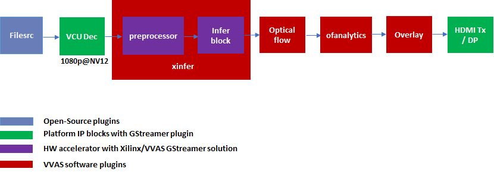

# Optical Flow based Analytics 

This optical flow analytics tutorial demonstrates building Gstreamer application using VVAS and xfopencv optical flow function.  This example design can be modified and used in many other applications like object tracking, motion-based segmentation, depth estimation, stitching and video frame rate conversion etc.
This tutorial explains step by step approach to build zcu104 based platform and application for running optical flow based analytics.

# Folder structure

Below is the folder structure for building and running optical flow based analytics tutorial

```bash
  opticalflow-analytics
├── hw
└── sw
    └── vvas-gst-plugins
        ├── gst-libs
        │   └── gst
        │       └── vvas
        └── sys
            ├── ofanalytics
            ├── optflow
            └── overlay
```

hw folder contains files related to building the platform on zcu104.

sw/vvas-gst-plugins contains plugins

sw/vvas-gst-plugins/gst-libs/gst/vvas contains metadata structures

# Prerequisites

Before attempting the execution of application, please ensure that all the pre-requisites mentioned below are fulfilled.

## Hardware Requirements

- ZCU104 Evaluation Board Rev 1.0

- Micro USB cable, connected to laptop or desktop computer for the terminal emulator

- Micro SD card, 8 GB or larger, class 10 (recommended)

- Display port 1.2 supported Monitor with 1920x1080 as max resolution

- Display port 1.2 cable

## Software/Tools Requirements

(Refer Vitis Unified Software Development Platform 2021.2 Documentation for installation instructions)

- Serial terminal emulator (for example, Tera Term)

- Balena etcher or equivalent flashing tool to flash the SD Card image

- Vitis™ Unified Software Platform version 2021.2

- Petalinux tool version 2021.2

- Git

## System Requirements
Board must have access to the internet and be accessible from development system.

# Pre-built binaries

You may download the pre-built binaries by clicking the link [Release packages](https://www.xilinx.com/member/forms/download/xef.html?filename=vvas_optical_flow_analytics_2021.2_zcu104.zip).

**Note:**

   **The pre-buit binaries available for download from the link  mentioned above contain software copyrighted by Xilinx and third parties subject to one or more open source software licenses that are contained in the source code files available for download at the link mentioned below.  Please see the source code for the copyright notices and licenses applicable to the software in these binary files.  By downloading these binary files, you agree to abide by the licenses contained in the corresponding source code.**

You can download the source code by clicking [Source Code](https://www.xilinx.com/member/forms/download/xef.html?filename=vvas-apps-1.0_sources_for_sd_card_img.tar)

This pre-built binary package provides prebuilt binaries for quick running of optical flow based analytics plug-in on zcu104 board. User credentials need to be provicded for downloading these prebuild binaries.

Unzip the downloaded package vvas_optical_flow_analytics_2021.2_zcu104.zip.

```
unzip vvas_optical_flow_analytics_2021.2_zcu104.zip

```

Prebuilt binaries package includes

- sd_card.img: Image to be flashed on the SD Card on the zcu104 board.

- sdk.sh: This is required to generate sysroot. Sysroot is required only if building VVAS plugins and libraries required for opticalflow analystics. For execution of pre-built application sdk.sh it not required.

- vvas_ofexample_installer.tar.gz contains prebuilt plugins and libraries required for running opticalflow analytics application on top VVAS.

- models: Supported DPU models on this platform.

- app: Contains application executable and input json files.

- arch.json: Represents DPU architecture.


Let the path where release package is downloaded be represented as <RELEASE_PATH>.

In case user wants to see the Licenses and source code that was used to build these pre-built binaries, download [Source Licenses and Source Code](https://www.xilinx.com/member/forms/download/xef.html?filename=vvas_rel_1_1_thirdparty_sources.zip) that contain the Open Source Licenses and source code.

After downloading the pre-built binaries, user may go to section Board bring up to try the released SD card image.

# Example Design Creation

This section covers the steps to create a complete example design that comprise Base Platform, Hardware Accelerators (Kernels) and Software required to run optical flow analytics plugin.

## Base Platform

Optical flow analytics application requires video decoder, scalar to resizing the decoded frames and preprocessing, machine learning infer for object detection, optical flow estimator and finally display block to display the output.  To develop platform base with all these requirements, we use zcu104_vcuDec_DP base platform which has decoder and display.  This platform has hardware accelerated video decoding IP, Video Codec Unit (VCU).  For display, this platform supports display port.  The design also includes DPU 4096 core for Machine learning.

In addition to the above-mentioned hardware components, zcu104_vcuDec_DP supports following software components

- omxh264dec Gstreamer plugin

- Opensource framework like Gstreamer, OpenCV

- Vitis AI 2.0 libraries

- Xilinx Run Time (XRT)

## Compiling base platform

Complete sources along with workspace to build the platform is provided as part of this release. Follow the steps mentioned below to compile the platform.

1. Navigate to the folder, such as VVAS_SOURCES, to clone the VVAS source tree.

2. Clone VVAS repo:
```
git clone https://github.com/Xilinx/VVAS.git
```

3. Setup tool chain environment:
```
source <2021.2_Vitis>/settings64.sh
source <2021.2_Petalinux>/settings.sh
source <2021.2_XRT>/setenv.sh
```

4. Navigate to zcu104_vcuDec_DP platform folder:
```
cd <VVAS_SOURCES>/VVAS/vvas-platforms/Embedded/zcu104_vcuDec_DP
```

5. Compile the platform:
```
Make
```

After build is finished, platform will be available at:
```
 <VVAS_SOURCES>/VVAS/vvas-platforms/Embedded/zcu104_vcuDec_DP/platform_repo/xilinx_zcu104_vcuDec_DP_202120_1/export/xilinx_zcu104_vcuDec_DP_202120_1/
```

## Hardware Accelerators (Kernels)

The hardware accelerators required for optical flow analytics application need to be stitched wih platform build above.  For that, hardware accelerators required can be obtained by following steps:

1. For DPU kernel navigate to the folder where Vitis-AI need to be cloned say at <VITIS_AI_REPO>
```
git clone https://github.com/Xilinx/Vitis-AI.git
cd Vitis-AI/
git checkout tags/v2.0 -b v2.0
```
2. Multiscaler kernel sources are part of VVAS source tree and are located at:
```
<VVAS_SOURCES>/VVAS/vvas-accel-hw/multiscaler
```
3. For optical flow kernel navigate to the folder where Vitis_Libraries need to be cloned say at  <VITIS_LIB_REPO>
```
 git clone https://github.com/Xilinx/Vitis_Libraries.git
```
The Xilinx deep learning processor unit (DPU) is a configurable computation engine dedicated for convolutional neural networks. Refer to [DPU-TRD](https://github.com/Xilinx/Vitis-AI/blob/master/dsa/DPU-TRD/prj/Vitis/README.md)  for more information and compiling the DPU accelerator. The optical flow analytics example design adds on instance of B4096 DPU configuration and Multiscaler to the zcu104_vcuDec_DP platform.

Kernels may have different configurations for different application requirements. Hence it is recommended to build the kernels from the application design workspace with the required Kernel configuration for that application.

Each application design workspace provided with this VVAS release has the required Kernel configurations for that application.

In case one wants to change the kernel configuration, do these changes in the configuration files mentioned below.

Compilation of Kernels is initiated from the build process of the final design for the application. Hence kernel compilation steps are not covered separately here.

- Configuration of DPU:
```
hw/dpu_conf.vh
```
- Configuration of Multiscaler:
```
hw/v_multi_scaler_config.h
```
If required, modify the kernel configuration as per the requirements in these files.

## Creating SD card image

Now with availability of platform and sources for hardware accelerators, next step is to stitch the required hardware accelerators (kernels) into the platform and generate final SD Card image using Vitis Flow. For this a build example workspace is provided in hw folder

This workspace uses Vitis Flow that stitches kernels into the platform and generates final SD card image. Follow below mentioned steps to build the final image.
```
cd  hw
make PLATFORM=<PLATFORM_PATH > DPU_TRD_PATH=<DPU_PATH> HW_ACCEL_PATH=<MULTISCALER_PATH> VITIS_LIB_PATH=<VITIS_VISION_PATH>
```
All platform and kernel paths are set based on above steps
```
PLATFORM_PATH = <VVAS_SOURCES>/VVAS/vvas-platforms/Embedded/zcu104_vcuDec_DP/platform_repo/xilinx_zcu104_vcuDec_DP_202120_1/export/xilinx_zcu104_vcuDec_DP_202120_1/xilinx_zcu104_vcuDec_DP_202120_1.xpfm
DPU_PATH = < VITIS_AI_REPO >/dsa/DPU-TRD/
MULTISCALER_PATH = <VVAS_SOURCES>/VVAS/vvas-accel-hw
VITIS_VISION_PATH = <VITIS_LIB_REPO>/vison
```
Once above build is done, final sdcard image is available at
```
 /binary_container_1/sd_card.img
```
# Board bring up
1. Burn the SD card image sd_card.img (Either from [Release package](https://github.com/Xilinx/VVAS.git) or generated) using a SD card flashing tool like dd, Win32DiskImager, or Balena Etcher.

2. Boot the board using this SD card.

3. Once the board is booted, resize the ext4 partition to extend to full SD card size:
```
Resize-part /dev/mmcblk0p2
```
## Building Plugins and Metadata Libraries

No need to built VVAS Plugins and libraries as they are part of petalinux bsp and are built along with building platform. The plugins opticalflow, overlay and ofanalytics, and metadata structures ofmeta and overlaymeta are not part of VVAS1.1 release.  Hence, they need to build by following steps.

sysroot is need for building metadata libraries and plugins.  sysroot installer is available at:

```
<RELEASE_PATH>/sdk.sh
```
For installing create a folder, say sysroot in VVAS_SOURCES. Command for sysroot generation is:
```
<RELEASE_PATH>/sdk.sh -y -d VVAS_SOURCES/sysroot/
```
Now sysroot is installed.  Plugins and metadata libraries can be built by following steps:

- Navigate to opticalfow/sw folder

- Unset the LD library path environment variable:

```
   unset LD_LIBRARY_PATH
```
- Set the sysroot path:
```
source VVAS_SOURCES/sysroot/environment-setup-cortexa72-cortexa53-xilinx-linux
```
- Now build plugins and metadata libraries:
```
./build_optflow_analytics.sh
```
When above step is complete, plugins and metadata libraries are generated at install folder and also install/vvas_example_installer.tar.gz will be created.

## Board setup

This section will explain the steps need to be followed for running the optical flow analytics application on zcu104 board.

- Copy the install/vvas_ofexample_installer.tar.gz or <VVAS_SOURCES>/vvas_ofexample_installer.tar.gz onto the root folder (/) of the target board and untar it by

```
tar -xvf vvas_ofexample_installer.tar.gz -C /
```
This will install all new plugin and metadata libraries required for optical flow analytics application.

- For keeping model related files ceate /usr/share/vitis_ai_library/models folder on the board and copy the Vitis-AI models into it:
```
mkdir -p /usr/share/vitis_ai_library/models
scp -r <PREBUILT_BINARIES>/vvas_optical_flow_analytics_2021.2_zcu104/models/* root@<board ip>/usr/share/vitis_ai_library/models/
```
- Copy the <PREBUILT_BINARIES>/vvas_optical_flow_analytics_2021.2_zcu104/app folder of the application onto home folder of the board.
```
scp -r <PREBUILT_BINARIES>/vvas_optical_flow_analytics_2021.2_zcu104/app root@<board ip>:~/
```
This app folder contains json files and pipeline to run application on board

- To test the application, copy the video file on the board system:
```
mkdir -p ~/app/videos
scp -r <Path to Videos> root@<board ip>:~/app/videos
```
## Running application of board
The figure below shows typical pipeline used for running optical flow analytics application.  User can modify the ofanalytics plugin to suit his requirements or can enhance the plugin to use in different type of optical flow applications.



The example pipeline used for opticalfow analystic:

```
  gst-launch-1.0 multifilesrc location=$1 loop=true \
  ! h264parse \
  ! queue \
  ! omxh264dec internal-entropy-buffers=2 \
  ! tee name=t \
  t.src_0 \
  ! queue \
  ! videorate ! video/x-raw, framerate=10/1 \
  ! queue \
  ! vvas_xinfer preprocess-config=kernel_preprocessor_dev0_yolov3_voc_tf.json infer-config=kernel_yolov3_voc_tf.json name=infer \
  ! scalem.sink_master vvas_xmetaaffixer name=scalem scalem.src_master  ! fakesink async=false \
  t.src_1 \
  ! queue \
  ! scalem.sink_slave_0 scalem.src_slave_0 \
  ! queue \
  ! vvas_xoptflow xclbin-location="/mnt/sd-mmcblk0p1/dpu.xclbin" \
  ! queue max-size-bytes=0 min-threshold-buffers=1 max-size-buffers=2 max-size-time=0 \
  ! videorate ! video/x-raw, framerate=10/1 \
  ! queue \
  ! vvas_xofanalytics dir-of-interest-start=20 dir-of-interest-end=160 dir-of-interest-color=0xff0000 other-dir-color=0xff000000 \
  ! queue \
  ! vvas_xoverlay \
  ! queue \
  ! kmssink driver-name="xlnx" fullscreen-overlay=1 sync=false async=false -v

```

To run the pipe line
```
cd app
./ofanalytics.sh videos/<testvideo.h264>
```
When application starts running, we can observe detected objects with bounding boxes and arrow drawn over them.  The arrow on object indicates motion direction of object.  One of the immediate use case of this application is anomaly in video sequences.

Copyright 2022 Xilinx Inc.

Licensed under the Apache License, Version 2.0 (the "License"); you may not use this file except in compliance with the License. You may obtain a copy of the License at http://www.apache.org/licenses/LICENSE-2.0.

Unless required by applicable law or agreed to in writing, software distributed under the License is distributed on an "AS IS" BASIS, WITHOUT WARRANTIES OR CONDITIONS OF ANY KIND, either express or implied. See the License for the specific language governing permissions and limitations under the License.
