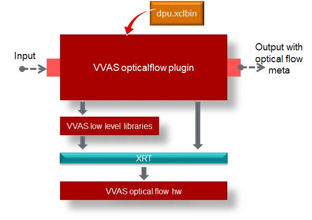

# VVAS optical flow plugin

Optical flow is one of the key function used in many image processing and computer vision applications like object tracking, motion based segmentation, depth estimation, stitching and video frame rate conversion etc.  Optical flow is estimated using previous and current frame pixel information.  

For optical flow estimation this plug-in uses hardware accelerator of xfopencv non-pyramid optical flow. This non-pyramid optical flow function takes current and previous frame as input and generates two floating point buffers of x and y direction displacements.  Optical flow plugin attaches these displacement buffers as gstvvasofmeta.

### Input & output

Accepts buffer of NV12 format and generates two metadata buffers of type float and each size equal to the size of frame.

### Plugin properties

| Property Name | Description | Type | Range | Default |
| --- | --- | --- | --- | --- |
| xclbin-loc | location of xclbin | string | NA | ./binary_container_1.xclbin |
| dev-idx | Device index | integer | 0 to 31 | 0 |

## Copyright and license statement
Copyright 2022 Xilinx Inc.

Licensed under the Apache License, Version 2.0 (the "License"); you may not use this file except in compliance with the License. You may obtain a copy of the License at
[http://www.apache.org/licenses/LICENSE-2.0](http://www.apache.org/licenses/LICENSE-2.0).

Unless required by applicable law or agreed to in writing, software distributed under the License is distributed on an "AS IS" BASIS, WITHOUT WARRANTIES OR CONDITIONS OF ANY KIND, either express or implied. See the License for the specific language governing permissions and limitations under the License.

This directory has sources for the example designs for Embedded Platforms.
Using these sources, user can create binaries (sd_card.img) that can be flashed onto the target board.
