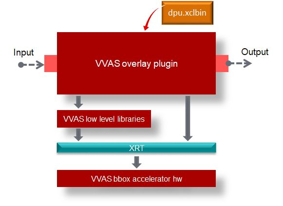

# VVAS Overlay plugin

Overlay plugin is used for drawing bounding boxes, text, lines, arrows, circles, and polygons on frames.  Bounding boxes can be drawn by using hardware accelerator.  By setting use-bbox-accel property of the plugin user can use hardware accelerator for drawing bounding boxes.  Using display-clock property user can display clock on any part of the frame. 

For drawing metadata on frames, all required metadata must be stored as gstvvasoverlaymeta type.  For converting metadata generated from upstream plugin like infer, opticalflow, segmentation etc., to gstvvasoverlaymeta an intermediate plugin is required before using this plugin.

### Supported features

| Feature | Description |
| --- | --- |
| boxes | Drawing bounding boxes with and without background color |
| text | Overlaying of text with and without background color. Supports text fonts available in opencv |
| lines | For drawing lines with different thickness and color |
| arrows | Drawing arrows on either side of line or both the sides |
| circle | For drawing circles of different radius and thickness without fill |
| polygons | For drawing closed polygons without fill |

### Input & output:

Supported input buffer formats are RGB, NV12 and Grayscale.  Required metadata in gstvvasoverlaymeta type for drawing.

### Plugin properties

| Property Name | Description | Type | Range | Default |
| --- | --- | --- | --- | --- |
| xclbin-loc | location of xclbin | string | NA | ./binary_container_1.xclbin |
| dev-idx | Device index | integer | 0 to 31 | 0 |
| display-clock | flag for indicating display clock     | Boolean       | 0 or 1 | 0 |
| use-bbox-accel |      flag to use accelerator for bounding boxes      | Boolean |     0 or 1  | 0 |
| clock-fontname |      font number for clock based on opencv   | int | 0 to 7  | 0 |
| clock-fontscale |     font scale of display clock     | float | 0.1 to 1.0 | 0.5 |
| clock-fontcolor       | RGB color of display clock as 0xRGB | int |   0 to 4,294,967,295 |    0xff00 |
| clock-xoffset | x starting position | int     | 0 to frame width      | 100 |
| clock-yoffset | y starting position | int     | 0 to frame height     | 50 |

## Copyright and license statement
Copyright 2022 Xilinx Inc.

Licensed under the Apache License, Version 2.0 (the "License"); you may not use this file except in compliance with the License. You may obtain a copy of the License at
[http://www.apache.org/licenses/LICENSE-2.0](http://www.apache.org/licenses/LICENSE-2.0).

Unless required by applicable law or agreed to in writing, software distributed under the License is distributed on an "AS IS" BASIS, WITHOUT WARRANTIES OR CONDITIONS OF ANY KIND, either express or implied. See the License for the specific language governing permissions and limitations under the License.

This directory has sources for the example designs for Embedded Platforms.
Using these sources, user can create binaries (sd_card.img) that can be flashed onto the target board.
