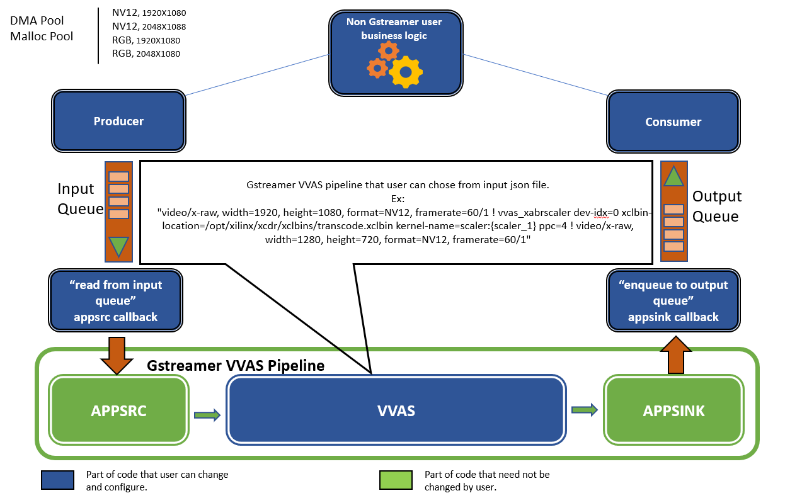
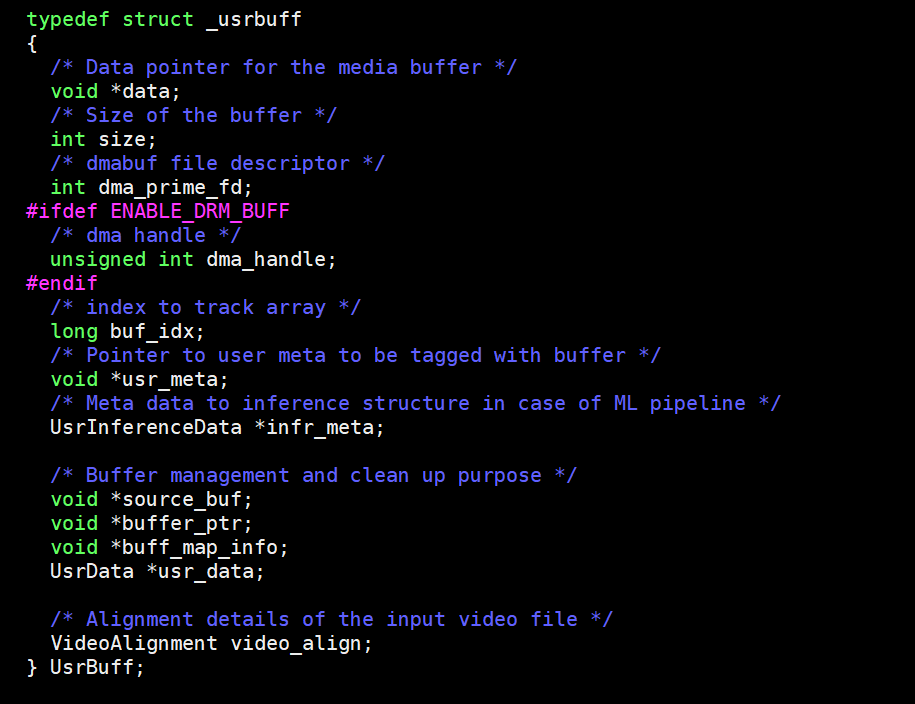
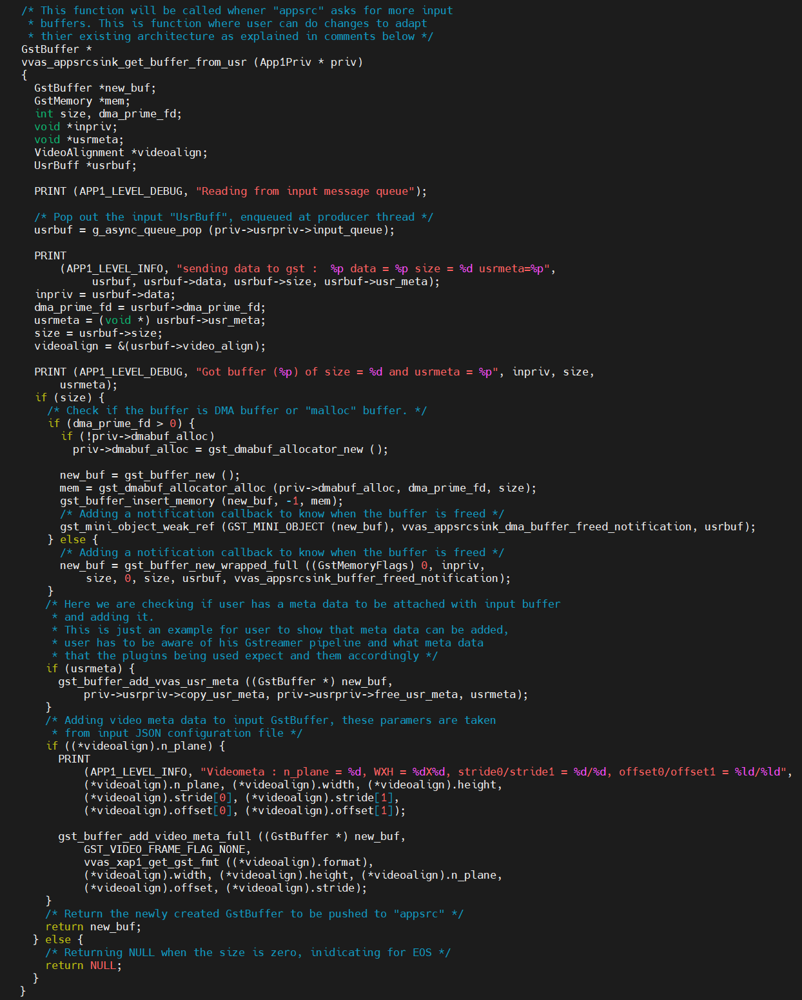
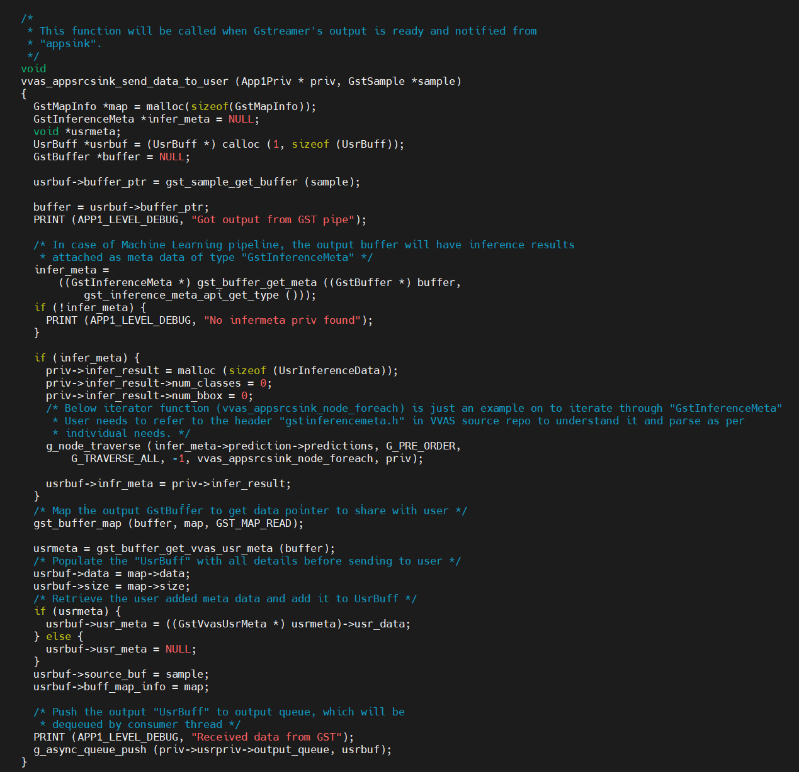
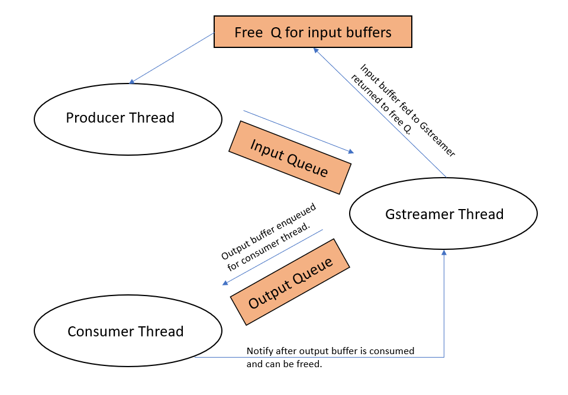

# VVAS Test Application to demonstrate ease of integration

# Table of contents

- [Introduction](#introduction)
- [Code Walkthrough](#code-walkthrough)
   - [Building the application](#building-the-application)
   - [Example run](#example-run)

## Introduction

This example application is a good reference to start using the VVAS Gstreamer plugins. It demonstrates how VVAS can be easily integrated into any existing architecture with some minor changes. User can run any VVAS Gstreamer pipeline through input configuration file and get output.  

This application demonstrates following.

 *  Injection of buffers to VVAS Gstremer pipeline : User can "malloc" his input buffers and feed to VVAS Gstreamer pipeline on DC platforms. On embedded systems, user also has a choice of using DMA buffers along with "malloc" software buffers using "libdrm" package. DMA buffers can be enabled on embedded using meson option explained in the later sections.  
 *  Extracting buffers from VVAS Gstreamer pipelines : Output buffers from VVAS Gstreamer pipeline will be given out through callbacks. These output GstBuffers will be unwrapped and packed into user structure, which will be explained in detail in later sections.
 *  Tagging user defined metadata with each input buffers and the same will be delivered back along with output buffers from VVAS Gstreamer pipeline.  

This application uses Gstreamer's appsrc signals to input video buffers to the VVAS Gstreamer pipeline and the appsink signals to extract output buffers. The application can also attach the user defined metadata along with each input buffer and delivers it back to consumer along with the output buffers.

This application has been tested with [VVAS 2.0](https://github.com/Xilinx/VVAS).

Below diagram shows the flow of buffers from input to output. Where user can input raw video frames through input queue and receive output through output queue.

## Code Walkthrough

The application code is divided into three parts.

- First, file "src/vvas_appsrcsink.c" has the code which reads from input file into "malloc" buffers and feeds them into input queue as shown in above flow diagram. Thread "vvas_appsrcsink_producer_thread" performs this task. This part of code is independent of Gstreamer. If user wants to fit in VVAS in their existing architecture, then this code can be replaced with any source of video feed they have, Ex: RTSP, HTTP etc.

Producer thread ("vvas_appsrcsink_producer_thread") reads from the input file and populates below structure. Application maintains a pool of below structure(UsrBuff) and uses it as the input pool. Addresses of these structures in pool are maintained in a queue, referred as free queue to keep track of free input structure available for use.

After populating each input structure (UsrBuff, shown below), its address will be enqueued into input queue. These will be dequeued by "appsrc" callback explained in later sections.

This section of code also has a consumer thread (vvas_appsrcsink_consumer_thread), which will be waiting on the output queue. The output queue will be enqueued whenever a output is received from Gstreamer.

 
- Second, file "src/vvas_appsrcsink_gst.c" creates and manages the VVAS Gstreamer pipeline supplied through input JSON config file. Thread "vvas_app1_start_gst_pipeline" handles this task. VVAS Gstreamer pipeline uses "appsrc" and "appsink" plugins to input and output buffers respectively. Application uses "appsrc" plugin's "need-data" signal callback to input buffers to "appsrc" and appsink's "new-sample" signal callback to receive output from "appsink"

- Third, file "src/vvas_appsrcsink_glue.c" bridges between first and second file. User can change this part of code to adapt their existing architecture. Below are the functions that user can modify to adapt.

**vvas_appsrcsink_get_buffer_from_usr**

This function will be called when "appsrc" asks for more input buffers. This function will dequeue input "UsrBuff" pointer that was enqueued from producer thread. The "data" member which has the media data will be wrapped into GstBuffer and pushed to "appsrc".

User can add any structure definition of his need and attach it to each input buffers (as void pointer type). "usr_meta" member of "UsrBuff" structure is meant for this purpose. Below code demonstrates the same.

**vvas_appsrcsink_send_data_to_user**

This function will be called when "appsink" notifies for the output buffer. Output GstBuffer will be unwrapped and populated into "UsrBuff" and enqueued into output queue. Consumer thread, which is waiting on the output queue will dequeue the output "UsrBuff". The output "data" pointer will be written to output file (output file name will be output.bin).

If the Gstreamer pipeline is for ML(Machine Learning) inferencing then output buffer will have "GstInferenceMeta" metadata attached with it. VVAS Gstreamer follows RidgeRun style of storing inference results. Refer below code on how its retrieved from output buffer.

**vvas_app1_free_gst_output**

This function needs to be called after the output buffer is consumed by consumer thread. This will clean up the output buffer memory.

As explained in above sections, the application mainly has 3 threads mentioned below and below flow diagram depicts the flow of buffers between them. 

- Producer thread : This thread feeds the input queue with input buffers read from input media file.
- Consumer thread : This thread reads buffers from output queue, which will be enqueued by Gstreamer's output as explained in above section.
- Gstreamer thread : This thread runs the Gstreamer pipeline provided by user.

Producer and consumer threads are entirely non Gstreamer part of the application and can be replaced with user business logic. That is, user can replace file read with his own input feed in producer and output file write can be replaced with rendering it on his choice of output device. User can change the meta data that needs to be sent across pipeline. 

### Building the application

#### Embedded platform
This application has been tested with VVAS 2.0, using [Smart Model Select](https://xilinx.github.io/VVAS/main/build/html/docs/Embedded/smart_model_select.html#smart-model-select-application) example. Pre-built binaries can be downloaded from the [link](https://xilinx.github.io/VVAS/main/build/html/docs/Embedded/smart_model_select.html#pre-built-binaries). Install "sdk.sh" (which is part of the pre-built binaries) as mentioned in the [link](https://xilinx.github.io/VVAS/main/build/html/docs/Embedded/smart_model_select.html#setting-sysroot). Follow steps as mentioned below to compile the application. Copy the compiled executable binary (vvas_appsrcsink) to hardware board and follow [example run](#example-run) section.

<pre>
source (PATH to SDK installed directory)/environment-setup-cortexa72-cortexa53-xilinx-linux
sed -E 's@<SYSROOT>@'"$SDKTARGETSYSROOT"'@g; s@<NATIVESYSROOT>@'"$OECORE_NATIVE_SYSROOT"'@g' meson.cross.template > meson.cross
cp meson.cross $OECORE_NATIVE_SYSROOT/usr/share/meson/aarch64-xilinx-linux-meson.cross

<b>Compile with "malloc" buffer for input buffer pool</b>

meson build --cross-file meson.cross --prefix /usr
cd build/
ninja
DESTDIR=../install ninja install

<b>Compile with DMA buffer for input buffer pool</b>

meson build --cross-file meson.cross --prefix /usr -Denable_dma=1
cd build/
ninja
DESTDIR=../install ninja install

</pre>

#### PCIe platforms
Follow below steps to build the application on PCIe platforms

<pre>
source /opt/xilinx/vvas/setup.sh
meson build --prefix /opt/xilinx/vvas/
cd build/
ninja
sudo ninja install

</pre>

### Example run

Follow below steps to run the application. Output will be stored in the current directory with name "output.bin"

<pre>
source /opt/xilinx/vvas/setup.sh     // Do this steps only for PCIe platforms.
./vvas_appsrcsink <input file> <JSON Config File>
</pre>

Example JSON configuration is explained below.

<pre>
{
  "format"     : 1,
  "width"      : 1920,
  "height"     : 1080,
  "num_planes" : 2,
  "stride"     : [1920, 1920],
  "debug_level" : 0,
  "pipeline"  : "video/x-raw, width=1920, height=1080, format=NV12, framerate=60/1 ! vvas_xabrscaler dev-idx=0 xclbin-location=/opt/xilinx/xcdr/xclbins/transcode.xclbin kernel-name=scaler:{scaler_1} ppc=4 avoid-output-copy=true ! video/x-raw, width=1280, height=720, format=NV12, framerate=60/1"
}
</pre>

JSON Field      |   Description
--------------- | ------------------------------
"format"        |  Format of the input file (follow enum "VideoFormat" in vvas_appsrcsink.h)
"width"         |  Width of the input file
"height"        |  Height of the input file
"num_planes"    |  Number of planes in the input file, applies only when the input is RAW video file (NV12, BGR)
"stride"        |  Stride of the input file
"debug_level"   |  Debug level
"pipeline"      |  Gstreamer pipeline string. Above example shows an example pipeline for scaling from 1080p to 720p 
